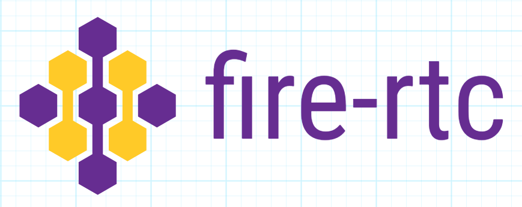

<p align="center">
  
</p>

Serverless webRTC using firebase's realtime database as a signaling broker.

[](https://travis-ci.com/mklan/fire-rtc)
[](https://www.npmjs.com/package/fire-rtc)
[](https://codecov.io/github/mklan/fire-rtc?branch=master)


## Install

```bash
npm install --save fire-rtc firebase
```

## Demo

[fire-rtc-chat](https://github.com/mklan/fire-rtc-chat)

## Usage

All the steps below needs to be executed on both sides, but the `initiator` value is different!


initialize a firebase app

```JavaScript
import firebase from 'firebase';

firebase.initializeApp({
  apiKey: 'XXXXXXXXXXXXXXXXXXX', 
  databaseURL: 'XXXXXXXXXXXXXXXXX', 
  projectId: 'XXXXXXXXXXXXXXXXXX'
});
```

after that create a new fireRTC instance and pass the firebase instance

```JavaScript
import createFireRTC from 'fire-rtc';

const fireRTC = createFireRTC({
      firebase, // pass the firebase instance
      id: 'my first serverless webrtc connection', // choose randomly and share with other party
      initiator: true, // the other party needs to set this to false and join afterwards!
      onConnect: handleConnect, // gets called when the connection is established
      onData: handleData, // gets called each time a new message arrives
    });

function handleConnect () {
  fireRTC.send('hello!')
}

function handleData(data) {
  console.log('new message', data);
}

```

## How does this work?

- both sdps are written to the database when creating a fireRTC instance.
- Both of you get notified of the others sdp config via the realtime db firebase event.
- After both parties have the other's sdp config, the webRTC connection can be established.
- The sdps are deleted because they are not needed anymore


https://webrtcglossary.com/sdp/

https://firebase.google.com/docs/database/web/read-and-write#basic_write

https://firebase.google.com/docs/database/web/read-and-write#listen_for_value_events

